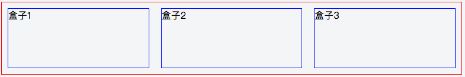
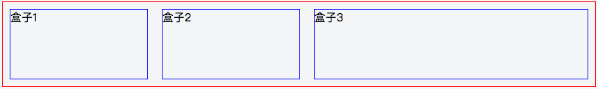

# FLEX布局

<p align="center">
    
</p>

网页布局是每个前端开发人员都会面对的，传统的布局方式我们往往会采用 `display` `position` `float` 这些 css 属性，但是面对日益增多且尺寸差异明显的移动设备上，我们发现这些 css 属性给我们带来了很多破坏性的问题，玩玩有些用户的手机上布局是好的，但是另外一些确是坏的，所以 flex 布局也呼之既出

flex 布局也叫 **弹性布局**，体现在它能够自动的伸缩来适应不同的页面尺寸，比如我们要完成这样一个布局：

<p align="center">
    
</p>

flex 很简单的就能帮我们搞定他,我们只要告诉父盒子你是一个弹性盒子（`display: flex`），然后告诉子元素你们在盒子中每个人只占了一等份（`flex: 1`）呢，这样子元素就会老老实实的占据着属于它的位置

html:
```html
<div class="father">
  <div class="child1">盒子1</div>
  <div class="child2">盒子2</div>
  <div class="child3">盒子3</div>
</div>
```

css:
```css
.father {
  border: 1px solid red;
  display: flex;
}
.father > div {
  border: 1px solid blue;
  height: 100px;
  width: 100px;
  flex: 1;
  margin: 10px;
}
```

但是这样会有人说这个不行，太简单了，我一个`width: 33.3%`就能搞定，诚然，这样确实能够完成，那么我们来试试把 `.child3` 的`flex`属性变成2看看会发生什么：

<p align="center">
    
</p>

是不是很神奇，`.child3`自动占据了盒子的2等份

在 flex 布局中有行（row）和列（column）之分，这也决定了盒子中元素的排列方式，并且它会受到元素的 dir 属性影响:
```html
<div dir="ltr"></div>   // left to right
<div dir="rtl"></div>   // right to left
```

flex 也可以让我们来设定布局的方向
```css
flex-direction: row | row-reverse | column | column-reverse
```
